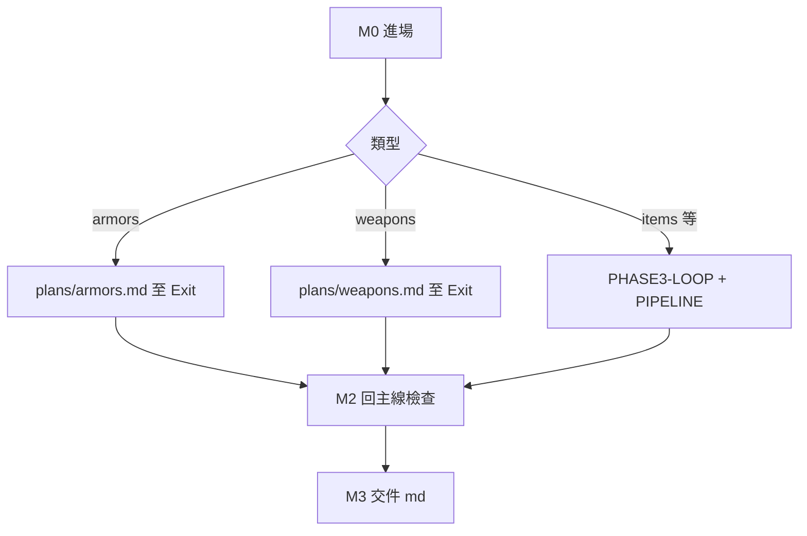

# MHF 繁中翻譯 — 主流程（orchestration）

> **Agent 流程真源。** 憲法：[`agent-translation-playbook.md`](../agent-translation-playbook.md)。  
> 次流程：[`armors.md`](armors.md)｜[`weapons.md`](weapons.md)｜道具等 [`PHASE3-LOOP.md`](../PHASE3-LOOP.md)＋[`PIPELINE.md`](../../l10n/working/PIPELINE.md)。  
> 狀態：[`progress.md`](../progress.md)｜[`queue.md`](../../l10n/working/issues/queue.md)。

## 0. 使用者終審契約（釘死）

| 誰 | 只看 | 禁止當主審 |
|---|---|---|
| **使用者** | **`reviews-*.md`**（與 CSV **全量同步**）；分層字典字首另開 **`series-dict-all.md`**（武器先 [`type-dict.md`](../../l10n/working/issues/weapons/type-dict.md)） | `series-dict.tsv`、qa hits tsv、wash tsv、scratch 表、抽樣前 N |
| **Agent** | `csv/`、`series-dict.tsv`、腳本 | 不得要求使用者改 tsv |

- **譯文終審**＝reviews md；**字首／type 裁定**＝all.md／type-dict.md。  
- 你改 md → 告知 agent → 回寫 tsv／CSV → **重產 reviews** → 必要時 P2。  
- `validate` PASS、`qa_done`、機械 QA 0 命中 **≠** 你已終審；**≠** 可宣稱全專案譯完。

---

## M0 進場（所有類型）

1. Playbook **核心目標**＋**Part A**（不通讀附錄長文）。  
2. 本檔 M1 表 → 開 **對應次 plan**（或 Gate3 附錄）。  
3. `progress.md`＋`queue.md` → **鎖定單一 CATEGORY**；禁止同輪混 armors＋weapons。  
4. 該類真源（CSV 或字典 tsv）；碰到用字再查 STYLE／terms。

---

## M1 執行次流程

| 類型 | 次 plan／附錄 |
|------|----------------|
| 防具五槽 | [`armors.md`](armors.md) |
| 武器近戰＋遠程 | [`weapons.md`](weapons.md) |
| 道具、monsters-description 等 | `PHASE3-LOOP`＋`PIPELINE` |
| 未在 queue 明示 | **不發明**新分支 |

次 plan 結尾 **`Exit → 回主線`** 條件滿足後，進 **M2**（不含「使用者已終審完」——那是 M3 之後）。

---

## M2 回主線 — 檢查表（全部勾完才可 M3）

### A. 機械誠實

- [ ] 該類 `validate_working.py`：**PASS**（寫入 `issues/<cat>/qa-*.md`）。  
- [ ] QA 腳本已跑：**need_semantic／truncate／wash／mismatch 等原始命中數**（禁空 PASS）。  
- [ ] 若本 session **改過 QA 腳本**：同一 issue 有 **改前／改後** 兩組數；**不得**仅靠放寬 heuristics 升 `qa_done`。

### B. 分層字典（armors、weapons）

- [ ] P1 新增／改 zh：**無** Composer 巨型 `patch_*` PATCH dict 充 P1；無 infer 腳本填 **S+A+B** 字義列。  
- [ ] Grok 不可用 → 該 stem **pending**，不套用。  
- [ ] L3 字義／專名：`source` 可核對（`搜：…→…`／`terms:` 等）；**禁**無搜尋的 `semantic:`／`web:`。  
- [ ] P2 後已刷新 **`series-dict-all.md`**（武器：S+A+B 有 zh，非 P0 裸 stem 當交件）。  
- [ ] **CSV 與 `reviews-*.md` 全量同步**（防具五槽、武器近遠程、道具子類）。

### C. 狀態

- [ ] `queue.md` 該類 **Blocking 清單**與 `progress.md` 一致。  
- [ ] **武器／防具：** §完成定義未滿足 → CATEGORY 與相關 CSV **維持 in_progress**；**禁止**因已做 M3 交件就標 `qa_done`。  
- [ ] **M3 ≠ 整類譯完：** M3 只交 md 供你終審；agent `qa_done` 見各次 plan §完成定義（武器含 reviews 全量、pending 清零等）。  
- [ ] **未**在 M3 要求使用者開 tsv／wash hits。

### D. 停點

- [ ] 未為 push／下一相位／commit 停問（commit **僅**使用者明示）。  
- [ ] 未回寫 mhfdat（除非你另案要求）。

---

## M3 交件（給使用者的格式）

1. **請你開（僅 md）：**  
   - **譯文終審：** 該類 **reviews 全量**（例：防具 `issues/armors/<slot>/reviews-*.md`；武器近遠程 review md；道具 `archive/.../review-*.md`）。  
   - **字首待審（若有）：** `series-dict-all.md`（武器含已定稿 `type-dict.md`）。  
2. **一行機械摘要：** validate、QA 命中、pending stem 數。  
3. **說明：** 你改 md 後告知，agent 回寫並重產 reviews。

---

## 續跑（禁誤停）

- **push／commit／下一相位／「先看哪份檔」** — **非停點**；預設做完次 plan 下一項，阻礙寫 `queue`。  
- **commit** 僅使用者明示；未要求則更新 progress／queue 即可。  
- 背景腳本失敗：**同輪**修或重跑，一句交代；不得當任務結束。  
- **僅可停問：** 回寫 mhfdat、方針真衝突、使用者明示要審、建 commit。

---

## Integrity（防再犯）

### P1／P3b 與 model

- **Auto ≠ 相位開關**：P1、P3b 須 **`Task` + `grok-4.7-high-fast`**（P1b：`cursor-grok-4.6-high-fast`）；P0／P2／P3＝`composer-2.5-fast` 或腳本。見 [`.cursor/rules/mhf-l10n.mdc`](../../.cursor/rules/mhf-l10n.mdc)。  
- **允許寫入 `series-dict.tsv` 的 zh：** Grok 批次、**L1 terms 機械**、**保留合格定稿**。  
- **禁止：** `patch_series_dict_*.py` 硬編 PATCH 當 P1；category 腳本 heuristic 冒充 Grok 歸類；**infer 腳本填 S+A+B 字義 zh**（C tier 僅 terms／同 stem 複製見 weapons plan）。  
- **判定失敗 → pending**；禁止 Composer 代填。  
- P1 留痕：每批 Grok 摘要寫入 `qa-*.md`（stem 數、pending 數）。

### QA 與 progress

- 機械清零 **≠** 使用者終審完；**≠** 字首定稿。  
- `qa_done`／`translated` 僅 playbook A.3 條件＋本檔 M2；**禁止** Translator 同輪自稱 qa_done。

### Plan 修訂與 baseline

- **修 plan 須使用者明示**；**修 plan ≠ 重跑套用**、≠ 清空 tsv 重洗。  
- 既有 `csv/`、`series-dict.tsv` 為 **baseline**；續作從現狀推進。  
- **僅以下可觸發 P2 重套用：** 使用者字首／reviews 定稿回寫、Fixer 修 blocking／high 後、使用者明示整槽重套用。

### 可重現性

- `scratch/` 內 apply／QA 若未入 git：同輪在 `issues/<role>/qa-*.md` 記 **可複跑命令**＋QA 計數；或腳本納入 commit。

---

## 修訂紀錄

| 日期 | 摘要 |
|------|------|
| 2026-10-05 | 初版：取代 MAIN-FLOW／layered-series-dict-*；釘 reviews 終審＋M2 integrity。 |
