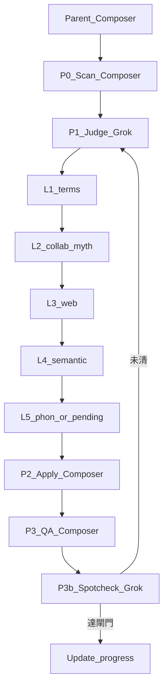

# 分層 series-dict＋Pro 內自動切模（合併修訂）

> 執行版同步自 Cursor plan `分層字典與模型路由_c8f441b9`。  
> 承接 QA 同意之補強；判定降級維持較嚴版（pending，不給 Composer 填譯）。

## 1. 約束（已釘死）

- **不停主線問你**：字典判定、apply、QA 依 [playbook Part A](../agent-translation-playbook.md) 逕行；僅 commit／大批回寫本體才停。
- **本輪預設**：`Rookie→新手`；明顯英文描述詞一律義譯；範圍先 **S+A（count≥10）**。
- **不另付款**：只用 Cursor Models 池：Grok 4.7／4.6、Composer 2.5。不用 Claude／GPT／Gemini 當預設。
- **Auto ≠ 相位開關**：父代理編排 + `Task` 帶固定 `model` slug。
- **禁止相位**：全表 `short_phonetic`／`compact_phonetic` 灌 TSV 當翻譯主腦。
- **品質天花板**：Grok＝池內判定檔，≠翻譯專模；靠分層＋出處＋P3b。
- **Fast 節制**：長批優先拆批；編排／腳本可用 `composer-2.5-fast`。

## 2. 架構

| 相位 | Owner | Model slug | 輸入 | 輸出 |
|---|---|---|---|---|
| 編排 | Parent | `composer-2.5-fast` | progress／queue／本計畫 | 派工、彙整 |
| P0 掃描＋分級 | 腳本／Composer | `composer-2.5-fast` | 五 CSV | `scratch/armor_stem_tiers.tsv`（category 空） |
| P1 歸類＋判定 | Grok | `grok-4.7-high-fast` | tiers 表＋wash＋terms | 覆蓋高頻 tsv；重寫 md |
| P1b 備援 | Grok | `cursor-grok-4.6-high-fast` | 同 P1 | 同 P1；**禁**改派 Composer 填 zh |
| P2 套用 | 腳本／Composer | `composer-2.5-fast` | 已定稿 tsv＋part-dict | 五部位 CSV |
| P3 機械 QA | 腳本／Composer | `composer-2.5-fast` | 五 CSV | 原始命中數 |
| P3b 語意抽核 | Grok | `grok-4.7-high-fast` | **僅** wash＋新 need_semantic | 修訂→回 P1 或結案 |

**判定失敗降級：** Grok 不可用／slug 無效 → 該批 **pending**；**禁止** Composer／腳本代填 `zh`。

## 3. 真源與範圍

- **機器真源：** `l10n/working/issues/armors/series-dict.tsv`
- **人讀摘要：** `l10n/working/issues/armors/series-dict.md`（不得只改前 40 行充數）
- **P0 產出檔名（釘死）：** `l10n/working/scratch/armor_stem_tiers.tsv`
- **分級：** S=`≥50`；A=`10–49`；B=`3–9`；C=`<3`。本輪判定＝**S+A**。
- **S+A：** L1–L5 能定則定；tsv **覆蓋**舊音譯／洗白列，**禁止**再叠 patch 腳本搶命中。
- **B／C：** 保留合格出處定稿；無出處／假音譯 → pending 或清空 zh，禁套用。
- **wash：** `l10n/working/scratch/_semantic_wash_hits.tsv`＝**P1 L4 必做輸入**；並作 `en_semantic` 最小詞表來源。

## 4. 已定稿（apply 操作定義）

可套用須同時：`zh` 非空；`reason` 不含「待查」且不只「音譯」；`source` 非空且屬 terms／神話／遊戲專名／合作／`搜：…→…`／字義。

不可套用：pending、無搜尋純音譯、source 空、scrub 後只剩部位詞。

## 5. 詞幹切法（P0／P2 與 apply 同規）

必須與 `l10n/working/scratch/apply_armor_series_dict.py`（及 `armor_overnight_pipeline` 的 COLORS／GRADES／strip_part）**同一套**：

- 剝部位（各槽 part-dict）、級別、色（含 `Water` 作色、`【 White 】`）、`Heaven`／`Earth`／`Summer`／織／魁等變體。
- `S・Sol` 類系列首碼**不當**第二級別。
- 最長前綴不得吞獨立色／SP；已知坑：White Snake、Kushala／バダル。
- 組裝：最多一個 `【】`、一個 `・`；部位詞只來自 part-dict（Arms＝護腕等）。

## 6. 工作流

### P0 — 掃描＋分級

1. 五 CSV → count／stem／slots／example_source／tier；寫入 `armor_stem_tiers.tsv`。
2. `category` 欄留空。
3. 詞幹切法抽樣自檢（上節已知坑各≥1 例）。

### P1 — 歸類＋判定（Grok）

- **S 一次做完；A 每批 40–50 stem。**
- 歸類標籤：`monster`／`collab`／`myth`／`game_proper`／`en_semantic`／`color_suffix`／`phonetic_last`／`pending`（Grok 填，非腳本亂貼）。
- L1 terms＋既有合格定稿 → L2 合作／神話 → L3 web（`source` 必含 `搜：…→…`）→ L4 字義（含 wash）→ L5 短音譯≤4 或 pending（不套用）。
- Judge 必須可 WebSearch。

**md 寫入契約（至少含）：** 維護流程；分級統計；歸類分布；pending 數；高頻已定稿表；STYLE 最多一個`【】`、一個`・`。

### P2 — 套用

只吃 §4 已定稿；自檢部位詞、【】／・、無片假名混中文。

### P3／P3b — QA

- P3：`validate_working.py`＋`qa_armor_transliteration.py`；**原始命中計數**。
- P3b：**只抽** wash＋新 `need_semantic`；未清 → 回 P1。
- progress：有 blocking／high → `qa_issues`；清零才可交審（禁 Translator 自稱 `qa_done`）。

## 7. Model Routing

見 [`.cursor/rules/mhf-l10n.mdc`](../../.cursor/rules/mhf-l10n.mdc) §Model Routing：

- 翻譯主線以 playbook Part A 為父；本表只約束 Task slug。
- 判定失敗 → pending，不降級 Composer 填譯。

## 8. 交付／不做

**交付：** `armor_stem_tiers.tsv`；tsv＋md；五 CSV；QA 計數寫入 qa-armors／progress／queue。

**不做：** 依賴 Auto 自選模；預設 Claude／GPT；質量音譯洗白；P1 對 B／C 全表強翻；未請示回寫本體／commit。
